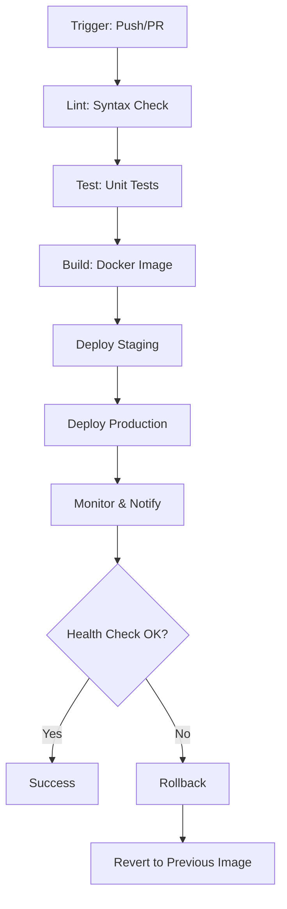

# CI/CD Pipeline Diagram

## Giải thích
- **Trigger**: Khi push code hoặc tạo PR
- **Lint**: Kiểm tra cú pháp
- **Test**: Chạy unit test
- **Build**: Tạo Docker image
- **Deploy Staging**: Triển khai lên môi trường thử nghiệm
- **Deploy Production**: Triển khai lên production
- **Monitor**: Giám sát và thông báo
- **Health Check**: Kiểm tra sức khỏe hệ thống
- **Rollback**: Quay về phiên bản trước nếu có lỗi